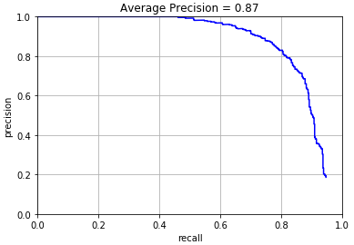
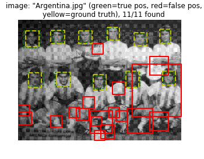
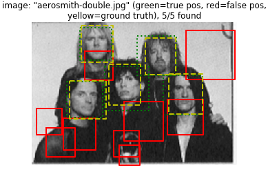
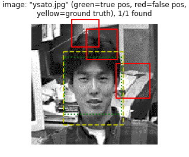
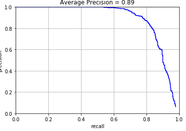
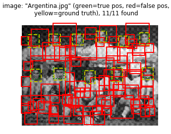
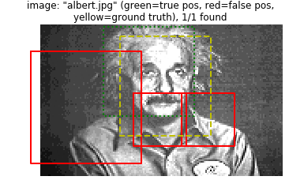
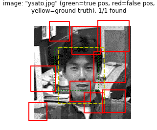

# 廖景輝 <span style="color:red">(1071082S)</span>

# Project 4:Face Detection with a Sliding Window

## Overview
This project is related to:

> Face Detection by sliding window classification

> SIFT-like Histogram of Gradients (HoG) representation


## Implementation

In this project, we need to implement four functions for face detecting. That is, get_positive_features.py, get_random_negative_features.py,svm_classify.py and run_detector.py. We will show details as below.

A. get_positive_features.py 
	
	Here, we need to use Histogram of Gradients (HoG) to obtain features of images with faces. And flatten it to size 1 * D for each image. Then we concatenate the flatten features for each image along row dimension. At last, we obtain feature_pos with size N * D ,where N is the numbers of input image.

	```
	def get_positive_features(train_path_pos, feature_params):
		# get image filename
		image_paths = glob(os.path.join(train_path_pos, '*.jpg'));
		
		# initialization
		hog_cell_size = feature_params['hog_cell_size'];
		N = len(image_paths);
		template_size = feature_params['template_size'];
		D = int(((template_size/hog_cell_size)**2)*31);
		features_pos = np.zeros((N,D));
		
		# hog
		for img_idx,img_name in enumerate(image_paths):
			hog_result = hog(imread(img_name), hog_cell_size);
			features_pos[img_idx,:] = np.reshape(hog_result,(1,D));
		return features_pos 
	```

B. get_random_negative_features.py

	In this function, we have to get non-face image's features. And the total number of samples is not equal the total images numbers. So I randomly choose the image first and then randomly crop the image patch out and use Hog to get its features. After reshape it, I concatenate the flatten features for each image along row dimension. Finally, we get our feature_neg with it's size num_samples*D 

	```
	def get_random_negative_features(non_face_scn_path, feature_params, num_samples):
		# get image filename
		image_paths = glob(os.path.join(non_face_scn_path, '*.jpg'));
		
		# initialization
		hog_cell_size = feature_params['hog_cell_size'];
		N = len(image_paths);
		template_size = feature_params['template_size'];
		D = int(((template_size/hog_cell_size)**2)*31);
		features_neg = np.zeros((num_samples,D));
		neg_examples = 'TODO';
		
		img_num = np.random.choice(N-1,num_samples);
		for i in tqdm(range(num_samples)):
			image = imread(image_paths[img_num[i]]);
			image = color.rgb2grey(image);
			start_i = random.randint(0,image.shape[0]-template_size);
			start_j = random.randint(0,image.shape[1]-template_size);
			patch = image[start_i:start_i+template_size,start_j:start_j+template_size];
			
			#hog
			hog_feats = hog(patch,hog_cell_size);
			features_neg[i,:] = np.reshape(hog_feats,(1,D));
		return features_neg, neg_examples
	```

C. svm_classify.py

	There, we use `LinearSVC` to train a linear classifier from the positive and negative examples with the setting of `random_state=0`.

	```
	def svm_classify(x, y):
		clf = svm.LinearSVC(random_state=0);
    	clf.fit(x,y);
		return clf
	```

D. run_detector.py

	In this part, we use `non-maximum suppression` on our detections. And for each image, we run the classifier at multiple scales to get more accurate accuracy. And call `non_max_supr_bbox.py` to remove duplicate detections. And we set the proper threshold and scale_step, we can get a perfect result

	```
		test_imag_path = os.path.join(test_scn_path, test_images[i]);
        img = color.rgb2grey(imread(test_imag_path));
        
        cur_bboxes = np.zeros([0, 4]);
        cur_confidences = np.zeros([0, 1]);
        cur_image_ids = np.zeros([0, 1]);
        
        min_size = min(img.shape[0], img.shape[1]);
        scale = 1;
        #th = -0.005;
        
        while scale*min_size > template_size:
            tmp_img = resize(img, output_shape=[int(img.shape[0]*scale), int(img.shape[1]*scale)])
            hog_feature = hog(tmp_img, hog_cell_size)

            for h in range(hog_feature.shape[0] - cell_num + 1):
                for w in range(hog_feature.shape[1] - cell_num + 1):
                    hog_result = hog_feature[h:h+cell_num,w:w+cell_num,:]
                    hog_result = np.reshape(hog_result, (1, -1))

                    confidences_now = np.reshape(model.decision_function(hog_result), (1, -1))
                    if confidences_now[0,0] > -0.005:
                        cur_confidences = np.concatenate([cur_confidences, confidences_now], axis=0)

                        cur_y_min = int((h-1) * hog_cell_size / scale + 1)
                        cur_y_max = int(((h-1)+ hog_cell_size) * cell_num / scale)
                        cur_x_min = int((w-1) * hog_cell_size / scale + 1)
                        cur_x_max = int(((w-1)+ hog_cell_size) * cell_num / scale)
                        
                        bboxes_now = np.array([[cur_x_min, cur_y_min, cur_x_max, cur_y_max]])
                        cur_bboxes = np.concatenate([cur_bboxes, bboxes_now], axis=0)
                        cur_image_ids = np.concatenate([cur_image_ids, [[test_images[i]]]], axis=0)

            scale = scale * 0.9 
	```


## Installation

* Other required packages

	* tqdm


### Results

step = 6 (accuracy = 0.86)
<table border=1>
<tr>
<td>




</td>
</tr>
</table>

step = 4 (accuracy = 0.89)
<table border=1>
<tr>
<td>




</td>
</tr>
</table>

From the result above, we can find that when step becomes smaller, we can get a higher accuracy. 


